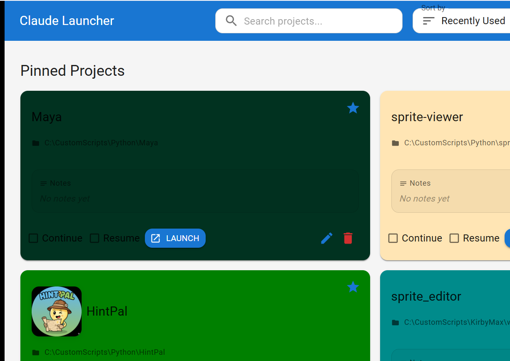

# Claude Launcher

[](https://rust-lang.org)
[](https://tauri.app)
[](https://react.dev)

A fast, native Windows desktop launcher for Claude Code projects, built with Tauri and React.



## Why Rust Instead of Python?

Originally designed with a Python sidecar, switched to pure Rust for:
- **Simpler architecture** — No IPC complexity or process management
- **Better performance** — Direct function calls vs process communication
- **Smaller binaries** — ~15MB vs ~50MB+ with Python bundled
- **Easier distribution** — Single executable, no runtime dependencies
- **More reliable** — No cross-process communication failures

This was the right call: startup is instant, distribution is one `.msi` file, and there are zero Python version compatibility issues.

## Features

- **Quick Launch** — Launch Claude Code projects with one click
- **Project Management** — Add, organize, and manage your coding projects
- **Tags & Notes** — Organize projects with custom tags and notes
- **Pin Favorites** — Pin frequently used projects to the top
- **Recent Projects** — Automatically tracks your 5 most recent projects
- **Smart Search** — Fuzzy search across names, tags, notes, and paths
- **Modern UI** — Clean Material-UI interface with light/dark theme support
- **Keyboard Navigation** — Navigate projects using arrow keys
- **Persistent Storage** — SQLite database stores all project data

## Tech Stack

- **Frontend**: React 18 + Material-UI + TypeScript
- **Backend**: Rust (Tauri 2.0)
- **Database**: SQLite with rusqlite
- **Build**: Vite + Tauri CLI

## Installation

### From Release (Recommended)

Download the latest `.msi` installer from the [Releases](https://github.com/semmlerino/claude-launcher/releases) page and run it.

### From Source

Prerequisites:
- Node.js 16+
- Rust (latest stable)
- Windows SDK

```bash
# Clone the repository
git clone https://github.com/semmlerino/claude-launcher.git
cd claude-launcher

# Install dependencies
npm install

# Run in development
npm run tauri dev

# Build for production
npm run tauri build
```

## Usage

1. **Add Projects**: Click the + button or drag folders into the app
2. **Launch Projects**: Click "Launch" on any project card
3. **Continue Session**: Check "Continue" to use the `--continue` flag
4. **Edit Details**: Click the edit icon to modify name, tags, or notes
5. **Pin Projects**: Click the star icon to pin to the top
6. **Search**: Use the search bar to filter projects

### Keyboard Shortcuts

- **Arrow Keys**: Navigate between project cards
- **Enter**: Launch the selected project
- **Tab**: Move focus between elements

## Data Storage

Project data is stored in a SQLite database at:
- Windows: `%APPDATA%\ClaudeLauncher\projects.db`

## Project Structure

```
├── src/                    # React frontend
│   ├── components/         # React components
│   ├── App.jsx            # Main app component
│   └── main.jsx           # Entry point
├── src-tauri/             # Rust backend
│   ├── src/
│   │   └── lib.rs         # Tauri commands & SQLite logic
│   └── tauri.conf.json    # Tauri configuration
└── package.json           # Node dependencies
```

## Troubleshooting

**Claude Code Not Found**: Ensure `claude` or `claude-code` is in your system PATH, then restart the launcher.

**Database Issues**: Delete `%APPDATA%\ClaudeLauncher\projects.db` to reset.

## License

MIT License — see [LICENSE](LICENSE) for details.
